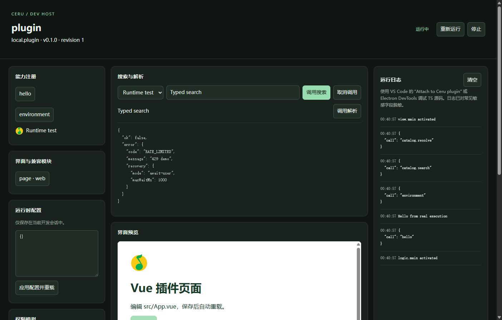

# Ceru Music Plugin Tooling

澜音插件开发工具链：TypeScript、Vue、React、单文件构建、Electron 调试工作台和动态发放。

这是 v2 协议的开发工具链。调试工作台会实际运行插件；当前音乐软件的 v1 Host 不能直接安装 v2 产物，正式桌面 Host 需要实现对应协议。

也可以从源码运行：npm ci、npm run build，再使用 node packages/create/dist/bin.js 创建工程。

## 快速开始

需要 Node.js 22.12+。

```bash
npm create ceru-plugin@latest my-plugin -- --template vue --lang ts
cd my-plugin
npm install
npm run dev
```

保存源码后进行类型检查并重载插件。工作台提供命令调用、搜索/解析测试、Schema/Web Surface 预览、运行日志、权限模拟、共享资源目录和源码调试。



```bash
npm run build
npm run validate
```

最终只交付 dist/plugin.js。也可通过 ceru-plugin build --out dist/plugin.jsx 选择 .jsx 文件名；内容仍是完成编译的标准 JavaScript，不要求安装时再编译 JSX。

## 模板

| 模板              | 内容                                         |
| ----------------- | -------------------------------------------- |
| source            | 本地搜索 demo、标准 Provider、结构化解析结果 |
| connected-library | 连接表单与状态更新 demo                      |
| importer          | 曲目去重与导入计划预览                       |
| guest-adapter     | 父插件与 Guest bootstrap 的边界              |
| web-surface       | 普通 DOM 页面                                |
| vue               | Vue 单文件组件、scoped CSS                   |
| vue-tsx           | Vue TSX 组件                                 |
| react             | React TSX/JSX、Hooks                         |
| web-dist          | 封装已构建的本地 index.html、脚本和样式      |

每种模板提供 TS 与 JS 变体。直接运行 npm create ceru-plugin@latest 可交互选择目录、模板和语言。

模板源码与社区成品插件在独立仓库维护：[CeruMusic-Plugin-Template](https://github.com/CeruMusic/CeruMusic-Plugin-Template)。CLI 内包含有摘要记录的模板快照，创建项目不临时执行远端模板脚本。

## Vue / React 如何进入一个文件

.vue、TSX/JSX 在开发机编译为 JavaScript。CSS、声明式界面与静态资源一起封装；安装时在独立 Surface 中挂载，不把第三方组件插入可信的主界面组件树。

从 0.1.2 开始，Vue/React 的生产运行代码直接打入每个插件的页面入口，与模板编译结果、样式和资源一起交付。宿主不提供 Vue/React，不需要 npm 依赖、CDN 或额外框架文件。旧工程的 sharedLibraries 配置会在构建时兼容处理，不再生成宿主框架依赖。

发行文件不会把 node_modules、TypeScript 编译器、Vue SFC 编译器、开发服务器或 npm 工程交给插件用户。

使用 npm run build 后，再运行 ceru-plugin preview dist/plugin.js：预览只读取发行文件，不访问源码工程，不注入 Vue/React。Vue 组件不可能在没有任何运行代码的情况下工作；这里把所需生产运行代码编成了文件内部的普通 JavaScript，而不是把开发环境带给用户。

已有网页产物可使用 web-dist 模板。当前支持本地静态 HTML、模块脚本、CSS 和普通图片/字体；远端脚本、HTML 内联事件、srcset 与依赖独立运行服务器的页面不属于该模式。

## 编辑器与共享能力

- VS Code 自带启动/附加调试配置、后台任务、JSON Schema 关联和代码片段。
- 按 F5 选择 Launch Ceru plugin；已启动时选择 Attach to Ceru plugin。
- 如果 VS Code 打开的是父目录或多个仓库，打开生成的 ceru-plugin.code-workspace 才能直接看到该子工程的配置；F5 始终执行“运行和调试”下拉框当前选中的配置。
- Launch 使用与包管理器无关的 Node 任务；已运行同一个项目时复用现有 Host，并等待 Electron 页面真正可附加后再开始调试。
- 激活代码已经执行时，点“重新运行”即可再次命中断点。
- Vue 模板推荐 Vue - Official 扩展；所有模板提供 Prettier 配置。
- SDK 提供参数、返回值、资源引用、错误码、权限名和图标名提示。

```typescript
import { definePlugin, hostIcon } from '@shiqianjiang/ceru-plugin-sdk'

const qqIcon = hostIcon('platform.tx')

export default definePlugin((ctx) => {
  ctx.actions.register('hello', async () => {
    const names = ctx.utils.lodash.uniq(['Morning', 'Night', 'Morning'])
    const icon = await ctx.icons.url('platform.tx')
    const cover = await ctx.assets.url('placeholder.cover')
    ctx.log.info('Shared utilities ready', { count: names.length })
  })
})
```

提供 25 个图标名称、3 个静态资源名称与 64 个类型化 Lodash 方法。图标包括 QQ、酷狗、酷我、网易云、咪咕及通用图标。声明里使用宿主资源引用，不会将这些图片或 Lodash 打进每一个插件。

## 命令

```text
ceru-plugin init <directory> --template source --lang ts
ceru-plugin list-templates
ceru-plugin build
ceru-plugin dev
ceru-plugin dev --no-open --port 4179
ceru-plugin preview dist/plugin.js
ceru-plugin validate dist/plugin.js --json
ceru-plugin keygen --out .keys/publisher
ceru-plugin sign dist/plugin.js --key .keys/publisher.private.pem
```

dev 默认打开独立 Electron 窗口；首次运行可能下载 Electron 二进制。--no-open 只运行本地工作台服务。未声明/未授予的网络请求默认拒绝；权限面板可授予精确 origin。

开发 Host 提供真实模块执行、隔离页面、HTTP 代理和有限媒体预览。生产安装授权、系统凭据保险箱、完整音乐业务、Guest 安装与分享服务不由此工作台代替。未实现的能力会明确报错。

## 动态发放

核心编译一次，为不同用户生成小型个性化数据和发放签名。

```bash
ceru-plugin keygen --out .keys/publisher
ceru-plugin keygen --out .keys/issuer
ceru-plugin template dist/plugin.js --key .keys/publisher.private.pem --issuer-key .keys/issuer.public.pem --out dist/template.js
ceru-plugin issue dist/template.js --key .keys/issuer.private.pem --config delivery.json --out dist/customer.js
```

delivery.json 的基础示例：

```json
{
  "display": { "name": "我的音源" },
  "activation": { "mode": "one-time-code", "code": "YOUR_REDEMPTION_CODE" }
}
```

默认个性化规则不允许任意配置键；额外字段需要在生成模板时通过 --policy 声明。权限、模块入口与核心代码不能通过个性化数据改写。

高并发服务直接使用发行库，而不是每次启动 CLI：

```typescript
import { readFile } from 'node:fs/promises'
import { PreparedIssuer } from '@shiqianjiang/ceru-plugin-issuer'

const issuer = new PreparedIssuer(await readFile('template.js'), {
  issuerPrivateKey: await readFile('issuer.private.pem', 'utf8'),
  trustedPublicKeys: [await readFile('publisher.public.pem', 'utf8')],
})

// 在业务接口中先验证订单/账号，再调用：
const file = issuer.issue(
  { display: { name: '用户的音源' } },
  { deliveryId: 'your-idempotency-id' },
)
```

writeTo(writable, data) 可流式写入固定主体，调用者负责结束流及 HTTP 鉴权/缓存策略。长期 Key 放入任何 JS 文件都可被复制；优先交付一次性激活信息，由服务端验证权益。

## 包

| npm 包                           | 用途                         |
| -------------------------------- | ---------------------------- |
| create-ceru-plugin               | 交互脚手架                   |
| @shiqianjiang/ceru-plugin-cli    | 构建、调试、校验与签名命令   |
| @shiqianjiang/ceru-plugin-sdk    | 插件作者的类型与小型辅助函数 |
| @shiqianjiang/ceru-plugin-issuer | 静态校验、签名、缓存模板发放 |

## 开发本工具链

```bash
npm ci
npm test
node scripts/sync-templates.mjs ../CeruMusic-Plugin-Template/templates
npm run pack:all
```

原生 Electron 集成检查：

```bash
node -e "require('electron')"
node test/electron-smoke.mjs /path/to/electron vue
```

Windows 示例路径为 node_modules/electron/dist/electron.exe。集成检查验证真实插件激活、共享资源、搜索/解析、框架按钮交互、源码映射、断点以及 Node/父页面隔离。

## 安全与许可

静态验证不是恶意代码沙箱。签名有效只说明内容对应某个密钥；没有可信公钥时，验证结果为 verified-untrusted。生产 Host 必须独立执行权限与资源边界。

工具源码为 MIT。调试预览中复用的 CeruMusic 图标/图片保留 AGPL-3.0-only 与原始署名，见 CLI 的 ASSET_LICENSE 和 NOTICE；第三方运行时保留各自许可证。模板引用宿主资源，不自动把这些预览资产复制到插件发行文件。

设计背景见 [设计文档](docs/design.md)，具体已实现接口以当前包和测试为准。
